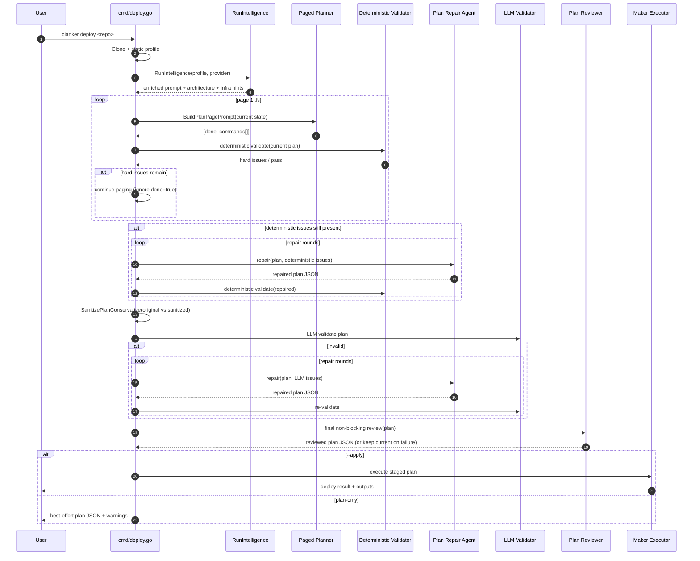

# Deploy Intelligence Pipeline

This package powers the `clanker deploy` intelligence flow from user query to plan/apply.

## Query → Deploy (Current Flow)

1. **Input + context setup**
    - `cmd/deploy.go` parses flags, provider/profile, and AI settings.
    - Repo is cloned and profiled (`CloneAndAnalyze`) for language, framework, ports, Docker/Compose, env hints.

2. **Intelligence pipeline (`RunIntelligence`)**
    - **Phase 0: Explore repo** (`explorer.go`) — agentic file reads to gather missing context.
    - **Phase 1: Deep analysis** (`intelligence.go`) — app behavior, services, startup/build commands, env requirements.
    - **Phase 1.25: Docker analysis** (`docker_agent.go`) — Docker/Compose topology, primary port, container runtime hints.
    - **Phase 1.5: Infra scan** (`infra_scan.go`, `cf_infra_scan.go`) — existing cloud resources to reuse.
    - **Phase 2: Architecture decision** (`intelligence.go`) — method/provider recommendation (e.g. EC2 for OpenClaw).
    - Produces `EnrichedPrompt` for planning.

3. **Paged plan generation (`paged_plan.go`)**
    - Plan is generated in **small command pages** instead of one large response.
    - Each page is parsed (`ParsePlanPage`), normalized via `maker.ParsePlan`, and appended with dedupe (`AppendPlanPage`).

- Parser tolerates either a page object or a plain command array (`[]commands`) from the LLM.
    - Page prompts include current command tail + produced bindings + required launch operations + unresolved hard issues.

4. **Deterministic guardrails (`plan_preflight_validate.go`)**
    - After each page (AWS path), deterministic checks run for hard failures:
        - launch step missing,
        - OpenClaw onboarding/compose requirements,
        - missing compose-required env vars,
        - secret inlining,
        - AWS wiring sanity checks.
    - waiter/order sanity for AWS runtime wiring (`ec2 wait instance-running` before target registration, `elbv2 wait load-balancer-available` before listener creation).
    - CloudFront command-shape sanity (`create-distribution` must not carry `--tags`) and OpenClaw output contract (`CLOUDFRONT_DOMAIN` + full `HTTPS_URL` with `https://`).
    - If hard issues remain, planner is forced to continue (`done=true` is ignored while issues remain).
    - Stuck detection fails fast in `--apply`; in plan-only mode it logs warnings and returns best-effort output.

5. **Deterministic repair pass (`plan_repair_agent.go`)**
    - If paged planning ends with deterministic issues, repair rounds are run to patch the plan JSON.
    - Re-validated deterministically each round before continuing.

- Validation findings are triaged (`plan_issue_triage.go`) into:
    - `hard-fixable` (sent to repair prompts),
    - `likely-noise` (excluded from repair loop),
    - `context-needed` (logged for operator follow-up).
- Repair prompts enforce a strict contract: preserve valid commands, minimal diff, fix only listed issues, avoid architecture changes unless required.

    5.5 **Bulk invariant pass (`plan_preflight_validate.go`)**

- After each bulk repair round, invariants are checked before moving on.
- **Generic baseline invariants (all repos):**
    - non-empty command list,
    - no unresolved placeholders,
    - IAM instance-profile readiness (`get-instance-profile`) before EC2 launch when role/profile wiring exists,
    - user-data quote sanity (detects common unterminated quote breakages).
- **Project overlay invariants:**
    - OpenClaw: HTTPS pairing URL shipped via CloudFront (create + wait + output), onboarding before gateway start.
- Overlay model keeps baseline checks generic while allowing targeted rules for known one-click projects.

6. **Conservative sanitizer (`plan_sanitize.go`)**

- Sanitization is **fail-open**: original vs sanitized plans are compared via deterministic issue count.
- Sanitized plan is used only when it is not worse than original.
- Includes generic arg normalization and safe command cleanup across providers, with targeted AWS managed-policy ARN normalization.

7. **LLM validation + repair (`ValidatePlan`)**
    - Once deterministic checks pass, the LLM validator reviews ordering/missing steps/port/env/IAM chaining.
    - If invalid, repair rounds rewrite plan JSON and re-validate.
    - Validation parsing is hardened against malformed model output.

- Repair/review parsing now uses LLM JSON-repair helpers (`llm_plan_integrity.go`) before giving up on a candidate.
- Retention guard is issue-driven: allows focused removals when issues/fixes justify them, blocks broad command collapse.
- In `--apply`, unresolved validation/repair issues are warning-first and flow continues to execution where runtime self-heal checks can remediate command-time failures.

8. **Final review pass (`plan_review_agent.go`)**

- A final reviewer agent reads the latest plan JSON and can append missing requirement commands.
- OpenClaw-on-AWS guidance is reinforced here (EC2 + CloudFront HTTPS pairing flow).
- This pass is **non-blocking**: parse/call failures keep the current plan and continue.

    8.5 **Generic integrity pass (`llm_plan_integrity.go`)**

- A provider-agnostic LLM integrity pass runs before final output/apply.
- Goal: minimal-diff command integrity fixes (tokenization, malformed waiter usage, `run-instances` flag/script boundary, CloudFront config arg shape), without architecture drift.
- Prompt policy is **balanced**: allows small safety corrections while preserving command order and intent.
- Includes explicit acceptance checks for recurring defects (for example merged `--tag-specifications` into user-data, missing ALB chain when ALB SG intent exists, and OpenClaw+ALB CloudFront HTTPS chain completeness).

9. **Plan finalize + apply orchestration**
    - Placeholder/binding resolution and provider-specific enrichment.
    - In `--apply`, execution is staged (infra → build/push when needed → workload launch → verification).

- OpenClaw apply path now seeds runtime env bindings from collected config and process env for key vars (gateway token/password, model API key, channel tokens, config/workspace dirs) so container startup receives complete runtime config.
- Optional CLI flag `--enforce-image-deploy` forces image-based deploy semantics (ECR image build/push + pull/run) and avoids relying on build-on-EC2 user-data paths.
- SSH safety rule: plans with SSH ingress on port 22 must use an explicit CIDR (not unresolved `<ADMIN_CIDR>` at apply time) or remove SSH ingress and rely on SSM-only access.
- Auto-remediation AI prompts now include deployment intent (plan question/context) so self-heal fixes stay aligned with the original deploy objective.

## Compact Sequence Diagram

## Key Files

- `intelligence.go` — main multi-phase intelligence + LLM validation
- `explorer.go` — agentic file exploration
- `docker_agent.go` — Docker/Compose understanding
- `infra_scan.go` / `cf_infra_scan.go` — cloud inventory snapshots
- `paged_plan.go` — paginated planning protocol + prompt builder
- `plan_preflight_validate.go` — deterministic hard checks
- `plan_repair_agent.go` — plan rewrite/repair agent
- `plan_issue_triage.go` — triage for hard-fixable vs noise/context findings
- `plan_sanitize.go` — conservative fail-open plan sanitizer
- `plan_review_agent.go` — final non-blocking plan reviewer pass
- `llm_plan_integrity.go` — LLM JSON repair + generic integrity pass
- `resolve.go` / `userdata_fixups.go` / `nodejs_userdata.go` — placeholder and user-data fixups
