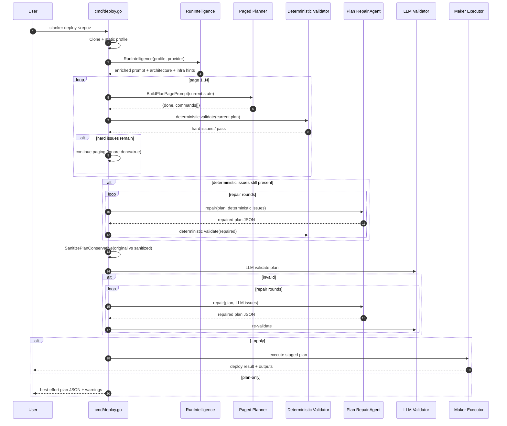

# Deploy Intelligence Pipeline

This package powers the `clanker deploy` intelligence flow from user query to plan/apply.

## Query → Deploy (Current Flow)

1. **Input + context setup**
    - `cmd/deploy.go` parses flags, provider/profile, and AI settings.
    - Repo is cloned and profiled (`CloneAndAnalyze`) for language, framework, ports, Docker/Compose, env hints.

2. **Intelligence pipeline (`RunIntelligence`)**
    - **Phase 0: Explore repo** (`explorer.go`) — agentic file reads to gather missing context.
    - **Phase 1: Deep analysis** (`intelligence.go`) — app behavior, services, startup/build commands, env requirements.
    - **Phase 1.25: Docker analysis** (`docker_agent.go`) — Docker/Compose topology, primary port, container runtime hints.
    - **Phase 1.5: Infra scan** (`infra_scan.go`, `cf_infra_scan.go`) — existing cloud resources to reuse.
    - **Phase 2: Architecture decision** (`intelligence.go`) — method/provider recommendation (e.g. EC2 for OpenClaw).
    - Produces `EnrichedPrompt` for planning.

3. **Paged plan generation (`paged_plan.go`)**
    - Plan is generated in **small command pages** instead of one large response.
    - Each page is parsed (`ParsePlanPage`), normalized via `maker.ParsePlan`, and appended with dedupe (`AppendPlanPage`).

- Parser tolerates either a page object or a plain command array (`[]commands`) from the LLM.
    - Page prompts include current command tail + produced bindings + required launch operations + unresolved hard issues.

4. **Deterministic guardrails (`plan_preflight_validate.go`)**
    - After each page (AWS path), deterministic checks run for hard failures:
        - launch step missing,
        - OpenClaw onboarding/compose requirements,
        - missing compose-required env vars,
        - secret inlining,
        - AWS wiring sanity checks.
    - If hard issues remain, planner is forced to continue (`done=true` is ignored while issues remain).
    - Stuck detection fails fast in `--apply`; in plan-only mode it logs warnings and returns best-effort output.

5. **Deterministic repair pass (`plan_repair_agent.go`)**
    - If paged planning ends with deterministic issues, repair rounds are run to patch the plan JSON.
    - Re-validated deterministically each round before continuing.

6. **Conservative sanitizer (`plan_sanitize.go`)**

- Sanitization is **fail-open**: original vs sanitized plans are compared via deterministic issue count.
- Sanitized plan is used only when it is not worse than original.
- Includes generic arg normalization and safe command cleanup across providers, with targeted AWS managed-policy ARN normalization.

7. **LLM validation + repair (`ValidatePlan`)**
    - Once deterministic checks pass, the LLM validator reviews ordering/missing steps/port/env/IAM chaining.
    - If invalid, repair rounds rewrite plan JSON and re-validate.
    - Validation parsing is hardened against malformed model output.

- In `--apply`, validation remains strict; in plan-only mode, unresolved validator issues are advisory and plan output is still returned.

8. **Plan finalize + apply orchestration**
    - Placeholder/binding resolution and provider-specific enrichment.
    - In `--apply`, execution is staged (infra → build/push when needed → workload launch → verification).

## Compact Sequence Diagram

## Key Files

- `intelligence.go` — main multi-phase intelligence + LLM validation
- `explorer.go` — agentic file exploration
- `docker_agent.go` — Docker/Compose understanding
- `infra_scan.go` / `cf_infra_scan.go` — cloud inventory snapshots
- `paged_plan.go` — paginated planning protocol + prompt builder
- `plan_preflight_validate.go` — deterministic hard checks
- `plan_repair_agent.go` — plan rewrite/repair agent
- `plan_sanitize.go` — conservative fail-open plan sanitizer
- `resolve.go` / `userdata_fixups.go` / `nodejs_userdata.go` — placeholder and user-data fixups
