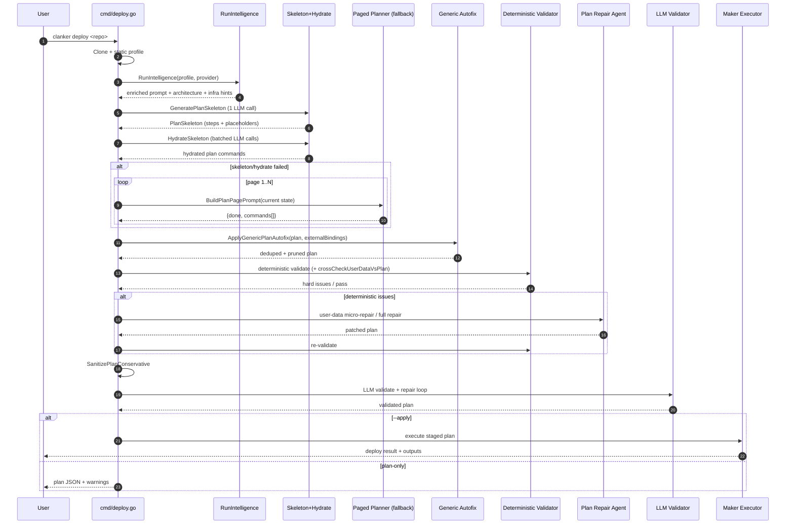

# Deploy Intelligence Pipeline

This package powers the `clanker deploy` intelligence flow from user query to plan/apply.

## Query → Deploy (Current Flow)

1. **Input + context setup**
    - `cmd/deploy.go` parses flags, provider/profile, and AI settings.
    - Repo is cloned and profiled (`CloneAndAnalyze`) for language, framework, ports, Docker/Compose, env hints.

2. **Intelligence pipeline (`RunIntelligence`)**
    - **Phase 0: Explore repo** (`explorer.go`) — agentic file reads to gather missing context.
    - **Phase 1: Deep analysis** (`intelligence.go`) — app behavior, services, startup/build commands, env requirements.
    - **Phase 1.25: Docker analysis** (`docker_agent.go`) — Docker/Compose topology, primary port, container runtime hints.
    - **Phase 1.5: Infra scan** (`infra_scan.go`, `cf_infra_scan.go`) — existing cloud resources to reuse.
    - **Phase 2: Architecture decision** (`intelligence.go`) — method/provider recommendation (e.g. EC2 for OpenClaw).
    - Produces `EnrichedPrompt` for planning.

3. **Skeleton + hydrate plan generation (`skeleton_plan.go`) — primary path**
    - **Phase 3a: Skeleton** — single LLM call produces a lightweight `PlanSkeleton` (service, operation, reason, produces, dependsOn per step). No real CLI args yet.
    - Skeleton is validated (`validateSkeleton`): checks required launch ops are present, flags duplicates using a composite key of `(service, operation, produces, dependsOn)`.
    - **Phase 3b: Hydrate** — skeleton steps are batched (max 5 consecutive independent steps per batch) and each batch is hydrated into real `maker.Command` structs via separate LLM calls.
    - Hydrate prompts enforce resource name consistency across steps (e.g. ECR repo names in user-data must match earlier `ecr create-repository` commands).
    - If skeleton or hydration fails, falls back to the **paged plan generation** path.

    3b. **Paged plan generation (`paged_plan.go`) — fallback path**
    - Plan is generated in **small command pages** instead of one large response.
    - Each page is parsed (`ParsePlanPage`), normalized via `maker.ParsePlan`, and appended with dedupe (`AppendPlanPage`).
    - Parser tolerates either a page object or a plain command array (`[]commands`) from the LLM.
    - Page prompts include current command tail + produced bindings + required launch operations + unresolved hard issues.
    - When both skeleton and paged plans exist, the one with fewer deterministic issues wins.

4. **Generic plan autofix (`plan_autofix.go`)**
    - Runs after plan generation (both skeleton and paged paths).
    - **SSM semantic dedup** — deduplicates SSM `send-command` / `put-parameter` steps that do the same thing.
    - **Launch cycle dedup** — removes redundant `run-instances` cycles within the same project.
    - **Read-only dedup** — collapses repeated read-only commands (describe/get/list).
    - **Orphan placeholder pruning** — removes commands that reference `<PLACEHOLDER>` values never produced by any earlier command. Accepts `externalBindings` (user-provided env var names) so user env vars are treated as "produced" and not orphan-pruned.
    - **User-data placeholder normalization** — rewrites `<USER_DATA_*>` variants to canonical `<USER_DATA>`.
    - **Critical command protection** — `run-instances`, `create-load-balancer`, `create-distribution` are never removed by autofix.

5. **Deterministic guardrails (`plan_preflight_validate.go`)**
    - Deterministic checks run for hard failures:
        - launch step missing,
        - OpenClaw onboarding/compose requirements,
        - missing compose-required env vars,
        - secret inlining,
        - AWS wiring sanity checks.
    - Waiter/order sanity for AWS runtime wiring (`ec2 wait instance-running` before target registration, `elbv2 wait load-balancer-available` before listener creation).
    - CloudFront command-shape sanity (`create-distribution` must not carry `--tags`) and OpenClaw output contract (`CLOUDFRONT_DOMAIN` + full `HTTPS_URL` with `https://`).
    - **User-data vs plan cross-check** (`crossCheckUserDataVsPlan`) — decodes base64 user-data from `run-instances` commands, extracts ECR image references, and verifies they match ECR repositories created in the plan. Catches hallucinated repo name mismatches.
    - **Bulk invariant checks:**
        - non-empty command list, no unresolved placeholders,
        - IAM instance-profile readiness before EC2 launch,
        - user-data quote sanity (detects unterminated quote breakages).
    - **Project overlay invariants:**
        - OpenClaw: HTTPS pairing URL via CloudFront, onboarding before gateway start.
    - Stuck detection fails fast in `--apply`; in plan-only mode it logs warnings and returns best-effort output.

6. **Deterministic repair + triage**
    - If planning ends with deterministic issues, repair rounds (`plan_repair_agent.go`) patch the plan JSON and re-validate.
    - Findings are triaged (`plan_issue_triage.go`) into `hard-fixable`, `likely-noise`, and `context-needed`.
    - Repair prompts enforce strict contract: preserve valid commands, minimal diff, fix only listed issues.
    - **User-data micro-repair** — targeted LLM fix for user-data script issues without touching the rest of the plan.

7. **Conservative sanitizer (`plan_sanitize.go`)**
    - Sanitization is **fail-open**: original vs sanitized plans are compared via deterministic issue count.
    - Sanitized plan is used only when it is not worse than original.
    - Includes generic arg normalization and safe command cleanup across providers.

8. **LLM validation + repair (`ValidatePlan`)**
    - Once deterministic checks pass, the LLM validator reviews ordering/missing steps/port/env/IAM chaining.
    - If invalid, repair rounds rewrite plan JSON and re-validate.
    - Repair/review parsing uses LLM JSON-repair helpers (`llm_plan_integrity.go`) before giving up on a candidate.
    - Retention guard is issue-driven: allows focused removals when issues/fixes justify them, blocks broad command collapse.

9. **Final review + integrity passes**
    - **Review agent** (`plan_review_agent.go`) — non-blocking pass that can append missing commands.
    - **Generic integrity pass** (`llm_plan_integrity.go`) — provider-agnostic minimal-diff fixes (tokenization, waiter usage, `run-instances` flag/script boundary, CloudFront config shape) without architecture drift.

10. **Plan finalize + apply orchestration**
    - Placeholder/binding resolution and provider-specific enrichment.
    - In `--apply`, execution is staged (infra → build/push → workload launch → verification).
    - OpenClaw apply path seeds runtime env bindings from collected config and process env.
    - `--enforce-image-deploy` forces ECR image-based deploy (build/push + pull/run).
    - SSH safety rule: plans with SSH ingress on port 22 need explicit CIDR or fall back to SSM-only.
    - Auto-remediation prompts include deployment intent so self-heal stays aligned.

## Compact Sequence Diagram

```mermaid
sequenceDiagram
    autonumber
    participant U as User
    participant C as cmd/deploy.go
    participant I as RunIntelligence
    participant S as Skeleton+Hydrate
    participant P as Paged Planner (fallback)
    participant A as Generic Autofix
    participant D as Deterministic Validator
    participant R as Plan Repair Agent
    participant V as LLM Validator
    participant E as Maker Executor

    U->>C: clanker deploy <repo>
    C->>C: Clone + static profile
    C->>I: RunIntelligence(profile, provider)
    I-->>C: enriched prompt + architecture + infra hints

    C->>S: GeneratePlanSkeleton (1 LLM call)
    S-->>C: PlanSkeleton (steps + placeholders)
    C->>S: HydrateSkeleton (batched LLM calls)
    S-->>C: hydrated plan commands

    alt skeleton/hydrate failed
      loop page 1..N
        C->>P: BuildPlanPagePrompt(current state)
        P-->>C: {done, commands[]}
      end
    end

    C->>A: ApplyGenericPlanAutofix(plan, externalBindings)
    A-->>C: deduped + pruned plan

    C->>D: deterministic validate (+ crossCheckUserDataVsPlan)
    D-->>C: hard issues / pass

    alt deterministic issues
      C->>R: user-data micro-repair / full repair
      R-->>C: patched plan
      C->>D: re-validate
    end

    C->>C: SanitizePlanConservative

    C->>V: LLM validate + repair loop
    V-->>C: validated plan

    alt --apply
      C->>E: execute staged plan
      E-->>U: deploy result + outputs
    else plan-only
      C-->>U: plan JSON + warnings
    end
```

## Key Files

- `skeleton_plan.go` — two-phase skeleton+hydrate plan generation (primary path)
- `paged_plan.go` — paginated planning protocol (fallback path)
- `plan_autofix.go` — generic plan autofix (dedup, orphan pruning, critical command protection)
- `plan_preflight_validate.go` — deterministic hard checks + user-data vs plan cross-check
- `plan_repair_agent.go` — plan rewrite/repair agent
- `plan_issue_triage.go` — triage for hard-fixable vs noise/context findings
- `plan_sanitize.go` — conservative fail-open plan sanitizer
- `plan_review_agent.go` — final non-blocking plan reviewer pass
- `llm_plan_integrity.go` — LLM JSON repair + generic integrity pass
- `intelligence.go` — multi-phase intelligence + LLM validation
- `explorer.go` — agentic file exploration
- `docker_agent.go` — Docker/Compose understanding
- `infra_scan.go` / `cf_infra_scan.go` — cloud inventory snapshots
- `openclaw_plan_autofix.go` — OpenClaw-specific autofix (HTTPS_URL, compose hints)
- `userdata_autofix.go` / `userdata_fixups.go` / `userdata_repair.go` — user-data fixups
- `resolve.go` — placeholder/binding resolution
- `nodejs_userdata.go` — Node.js user-data generation
